# Team One
Nes Gomez, Jorge Benavente, Renee Perez, and Melissa Morales

# ESS Social Trends

## Dataset
The European Social Survey (ESS) is a pan-European research infrastructure providing freely accessible data for academics, policymakers, civil society and the wider public. 

This survey is conducted every 2 years and we used this data to identify any social trends across these 4 specific European countries: Finland, Hungary, Switzerland and United Kingdom, over the years of 2001 to 2022. 
Each presenter will be showcasing the different trends discovered while analyzing the data. 

# Question 1 

## Melissa 

# What is the Interplay between Chronic Internet Usage, Position on the Political Spectrum, and Broader Trust in Authority?
For these questions, we reviewed variables encompassing trust for various authority figures (police, politicians, legal system, and parliament), daily internet usage in minutes, and position on the political spectrum. We excluded all non-numerical and null values in each review. 

## Is high internet usage a predictor of political leanings?
We see a very strong correlation between interent usage and political ideologies, with an r-value of -0.889. In other words, as respondents self-reported as more conservative, we saw their internet usage time decrease by over 20% at its lowest. This decrease is relatively consistent over the political scale, with one exception. Those who self-reported as most conservative responded that their internet usage was much higher than all their conservative peers. 

When graphing internet usage vs turst in an authority figure - here legal system specifically - we saw only a moderate correlation(r-value: 0.447) between the two. Interestingly, we see a spike at either end of the trust scale, showing that those who spend the most time online have both the least and most trust in their countries legal system.

## How is trust in authority affected by political ideology? 
Going back to the politcal scale and comparing trust along it, showed another strong correlation (r-value: 0.648). As respondants self-reported more conservative, we saw an increase in trust, with the same previous exception present - that those who are at the extremes of either side reported lower trust than their counterparts on their half of the scale. Additionally though, we see a new dip appear, one at the center of our graph for people who stated they were moderates politically. 

More broadly, we see the same data shape when looking at other forms of authority. suggesting a similar correlation across all forms of trust.

# Does age have any correlation with overall trust in legal system? 

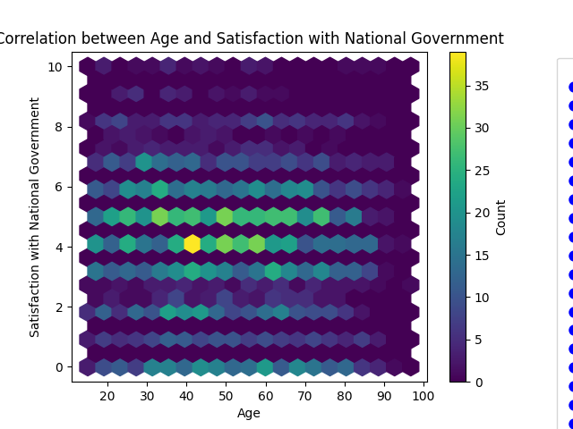
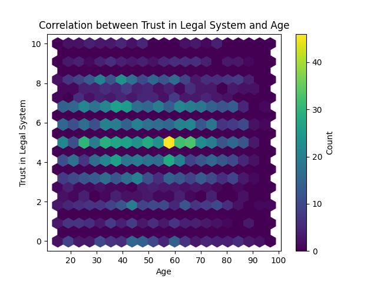
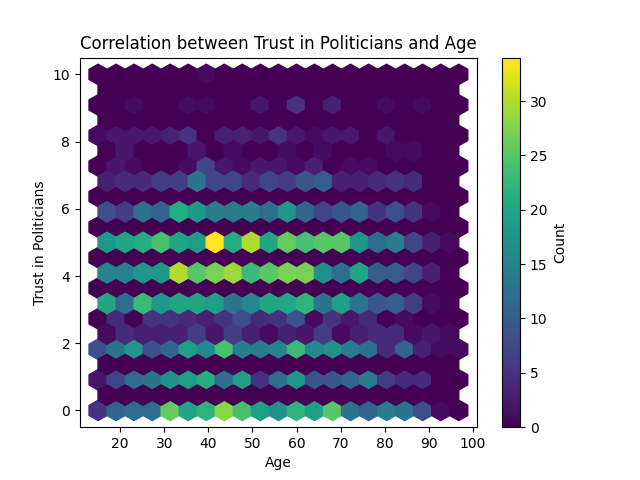
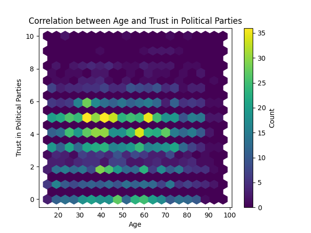
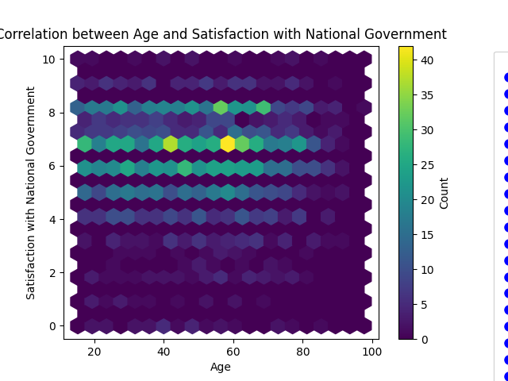
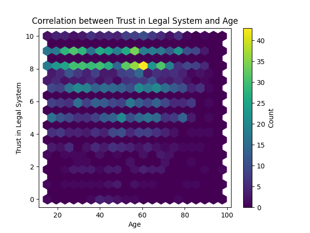
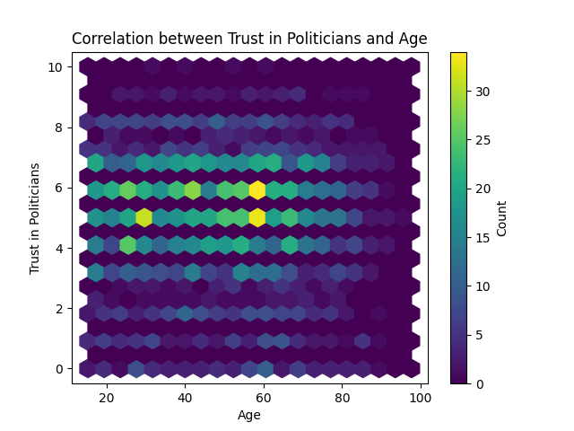
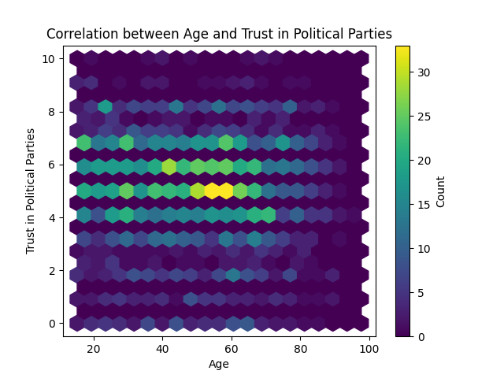
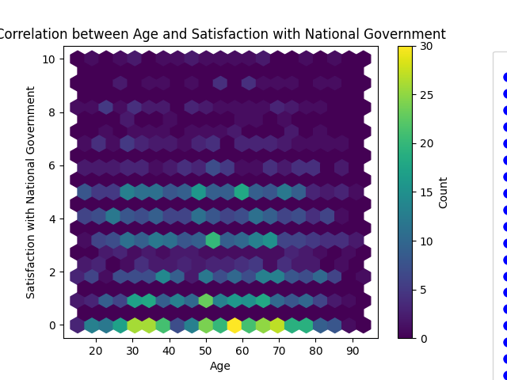
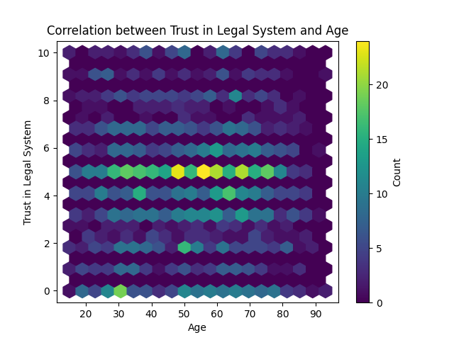
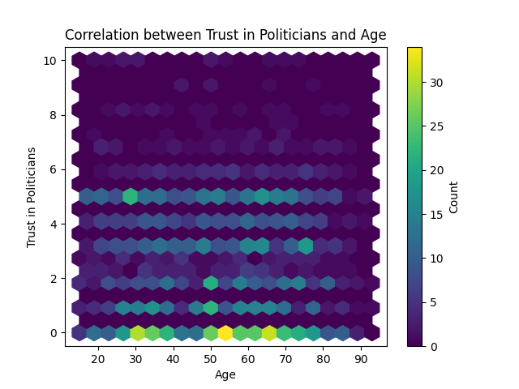
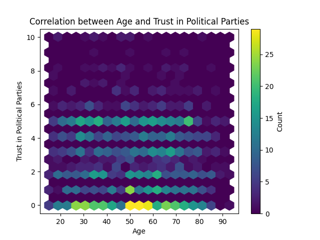
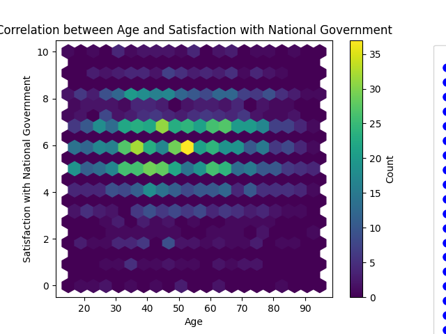
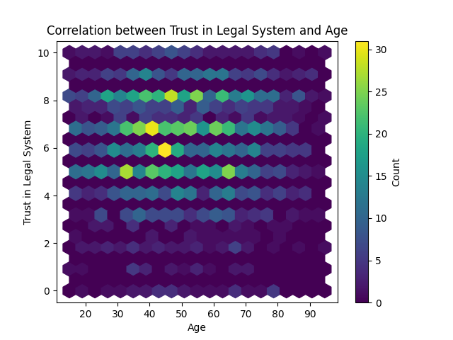
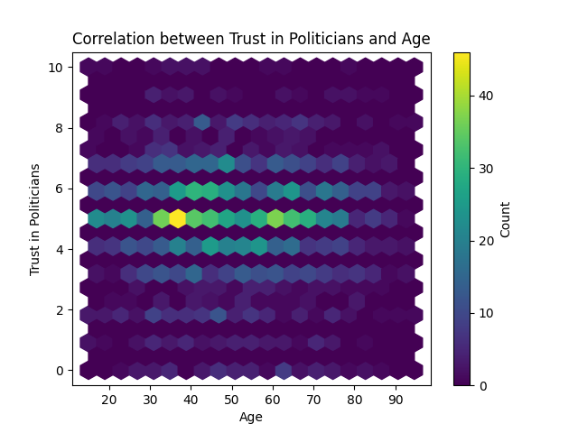
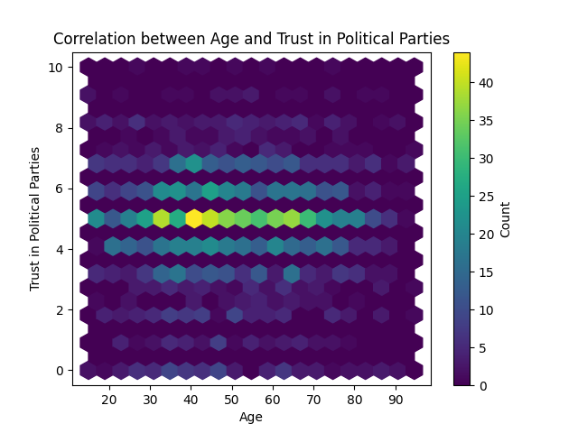

In summary and contrary to belief, there were no strong correlations between age of the respondent and their overall trust in the government and/or legal system. This may be due to the fact that the government in Finland, Hungary and United Kingdom operates under a single authority. Although, Switzerland has a very democratic approach and still there were no correlations of note.

#Were there any patterns in survey responses for each country? See below top correlation for each: 

In summary, the most notable correlations were from Finland, Switzerland and the United Kingdom. The data shows that there was a strong correlation in responses stating that their partner's occupation included being responsible for supervising other employees. The other correlations, although similar in significance, did not represent any substantial information. For example, many of them responded that they worked in the last 7 days, and got paid for work in last 7 days.

# Question 4 

## Jorge
The following variable independent were chosen 
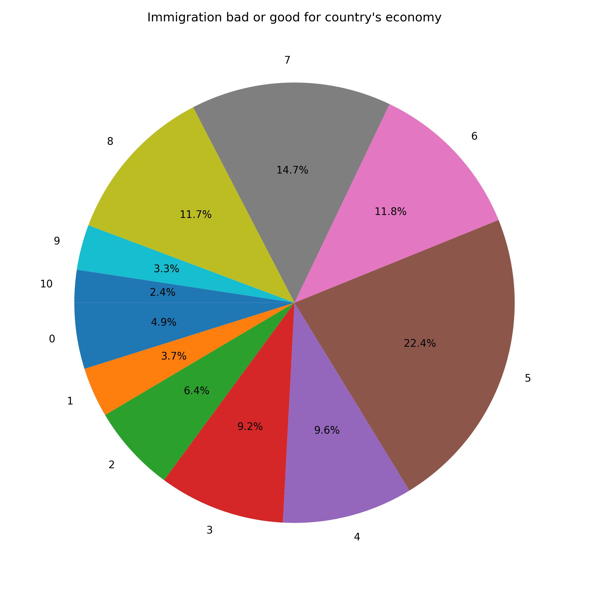
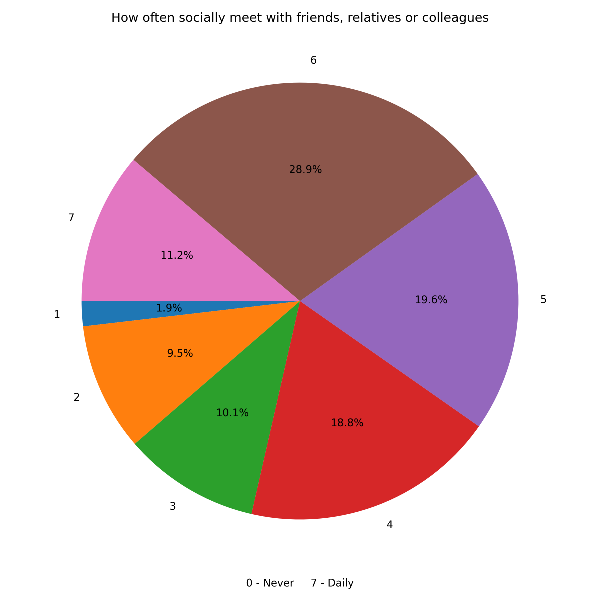

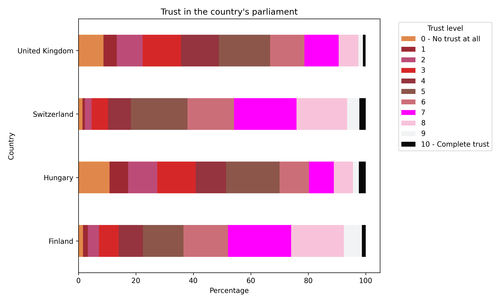
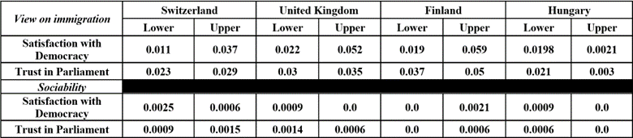

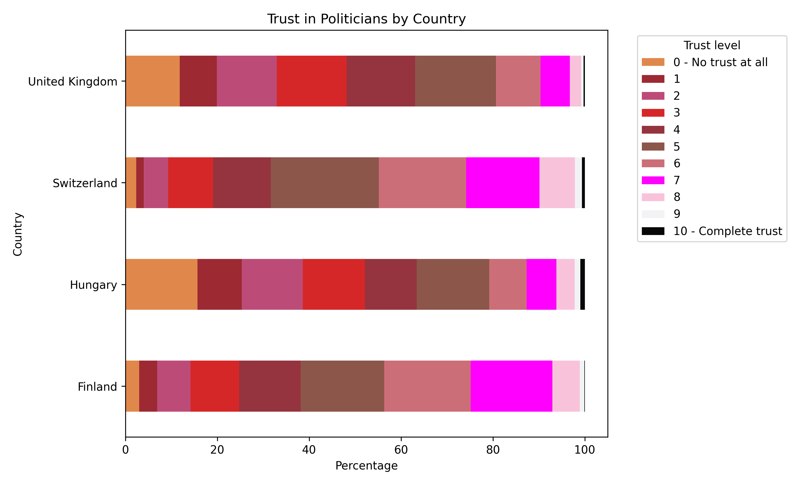
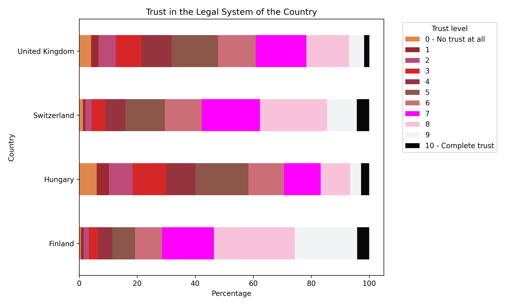
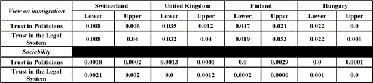

# Restrictions, limitations, and further study
Surveys are all collected in British English, which could exclude respondants who speak other languages primarily.

Out dataset included surveys taken between 2001 and 2022. Some fields included in our study were added later in the lifecycle of the survey. This led to some years of the survey being excluded for some visualizations porior to those fields being added.

# Resources
## Dataset: 
European Social Survey 
https://www.europeansocialsurvey.org/

## Team Gitlab
https://github.com/melmelmorales/team_one

## Script Locations

Nestor's scripts can be found at "Nes/NesGomezFinal.ipynb". Images can be found in "Nes/Images". Initial dataset and generated subset for each visualization can be found in "Nes/Data".

Renee's scripts can be found in the "Renee_Perez" Folder. The "RP.Age_Notebook.ipynb" and the "RP.Top_Correlations.ipynb". 
