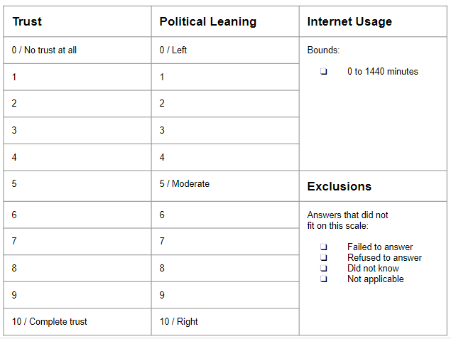
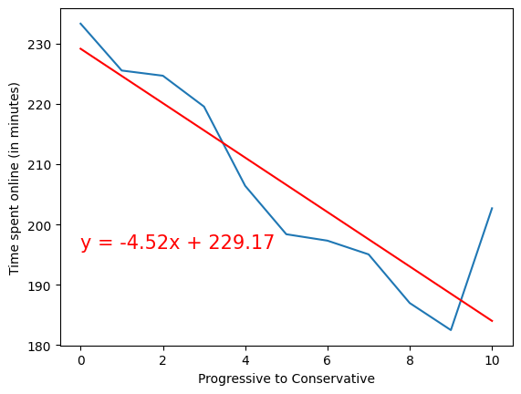
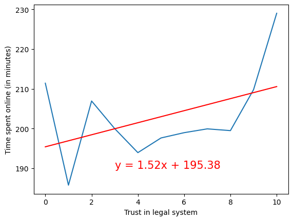
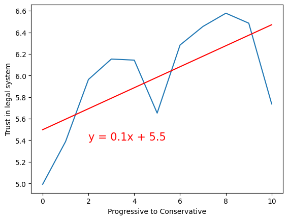
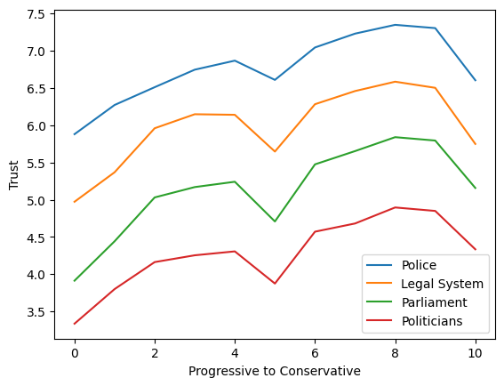

# Team One
Nes Gomez, Jorge Benavente, Renee Perez, and Melissa Morales

# ESS Social Trends
Data filters

Surveys collected over ten rounds, from 2001 andd stretching to the most recent round which ended in 2022, taking place every two years.
We explored trends across these 4 specific countries: Finland, Hungary, Switzerland and United Kingdom. 

# Question 1 

## Melissa 

# Question 2 

## Nestor 

# What is the Interplay between Chronic Internet Usage, Position on the Political Spectrum, and Broader Trust in Authority?
For these questions, we reviewed variables encompassing Trust for various authority figures (police, politicians, legal system, and parliament), daily internet usage in minutes, and position on the political spectrum. We excluded all non-numerical and null values in each review. Variable scale is included below.

## Is high internet usage a predictor of political leanings?
We see a strong correlation between interent usage and political ideologies, with an r-value of -0.889. In other words, as respondents self-reported as more conservative, we saw their internet usage time decrease by over 20% at its lowest. This decrease is relatively consistent over the political scale, with one exception. Those who self-reported as most conservative responded that their internet usage was much higher than all their conservative peers. 

On ther other hand, when graphing internet usage vs turst in an authority figure - here the legal system, we saw only a moderate correlation(r-value: 0.447) between the two. Here now we see a spike at either end of the data, showing that those who spend the most time online have both the least and most trust in their countries legal system.

## How is trust in authority affected by political ideology? 
Since the left to right scale yielded our highest correlatio prior we focus on that as our metric. 

# Question 3

## Renee
#### Renee's scripts can be found in the "Project 1" Folder. The "RP.Age_Notebook.ipynb" and the "RP.Top_Correlations.ipynb". 

## Does age have any correlation with overall trust in legal system? 

### In summary and contrary to belief, there were no strong correlations between age of the respondent and their overall trust in the government and/or legal system. This may be due to the fact that the government in Finland, Hungary and United Kingdom operates under a single authority. Although, Switzerland has a very democratic approach and still there were no correlations of note.

## Were there any patterns in survey responses for each country? See below top correlation for each: 

###

# Question 4 

## Jorge

# Restrictions, limitations, and further study
Surveys are all colelcted in british english

Some fields were added mid dataset and caused to exclude a large portion of data to inlcude them in specific visualizations.

# Resources
Data: 
European Social Survey 
https://www.europeansocialsurvey.org/

Team Gitlab
https://github.com/melmelmorales/team_one
