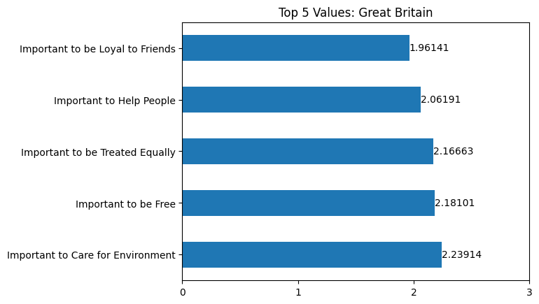
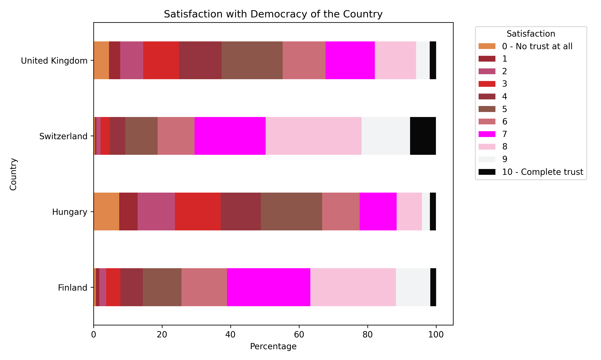

# Team One
Nes Gomez, Jorge Benavente, Renee Perez, and Melissa Morales

# ESS Social Trends

## Dataset
The European Social Survey (ESS) is a pan-European research infrastructure providing freely accessible data for academics, policymakers, civil society and the wider public. 

This survey is conducted every 2 years and we used this data to identify any social trends across these 4 specific European countries: Finland, Hungary, Switzerland and United Kingdom, over the years of 2001 to 2022. 
Each presenter will be showcasing the different trends discovered while analyzing the data. 

#  What are the top 5 Values of citizens from Finland, Hungary, Switzerland, and the United Kingdom?

The European Social Survey (ESS) assessed 21 personal values and requested participants to rate how closely a value resonates with oneself on a scale from "1", which means "Very Much Like Me," to "6", which means "Not Like Me at All." Of the 21 values scored, Finnish, Swiss, and British citizens' responses resonated most closely with one another. Each country valued loyalty to friends, the importance of freedom, the importance of the environment, the importance of helping others, and the importance to be treated equally in their top five. Statistically, the average responses fell between 1.6-2.5, which means citizens highly identified with the values recorded.

In contrast, Hungarian citizens valued a vastly different set of beliefs and attitudes. Instead, Hungarians valued safe surroundings, care for the environment, loyalty to friends, a strong and safe government, and to be treated equally in that respective order. The survey of personal values gives insight as to the most celebrated guiding beliefs of each culture and how certain attitudes may influence decision-making, as seen by later discussions.

# Which values are correlated amongst different European socieities?

Interestingly, political beliefs were some of the most correlated values amongst citizens of various countries. A Pearson correlation analysis of 25 variables was conducted and found that the magnitude of correlated values differed country to country. In Switzerland and Great Britain, R^2 values > 0.7 indicating strong, postive correlations were reported for only one pair of correlated values: Trust in Politicians and Trust in Political Parties. 

Similar to Swiss and British citizens, Finnish citizens also had the highest correlated value pair of Trust in Politicians and Trust in Political Parties with an R^2 value of 0.85. The next four pairs of correlated values showed a heterogeneous mix of loyalty to friends, helping others, care for the environment, and understanding others in different combinations. For future analyses, it would be worth exploring which value has the highest count of correlation amongst other values measured.

# What is the Interplay between Chronic Internet Usage, Position on the Political Spectrum, and Broader Trust in Authority?
For these questions, we reviewed variables encompassing trust for various authority figures (police, politicians, legal system, and parliament), daily internet usage in minutes, and position on the political spectrum. We excluded all non-numerical and null values in each review. 

## Is high internet usage a predictor of political leanings?
We see a very strong correlation between interent usage and political ideologies, with an r-value of -0.889. In other words, as respondents self-reported as more conservative, we saw their internet usage time decrease by over 20% at its lowest. This decrease is relatively consistent over the political scale, with one exception. Those who self-reported as most conservative responded that their internet usage was much higher than all their conservative peers. 

When graphing internet usage vs turst in an authority figure - here legal system specifically - we saw only a moderate correlation(r-value: 0.447) between the two. Interestingly, we see a spike at either end of the trust scale, showing that those who spend the most time online have both the least and most trust in their countries legal system.

## How is trust in authority affected by political ideology? 
Going back to the politcal scale and comparing trust along it, showed another strong correlation (r-value: 0.648). As respondants self-reported more conservative, we saw an increase in trust, with the same previous exception present - that those who are at the extremes of either side reported lower trust than their counterparts on their half of the scale. Additionally though, we see a new dip appear, one at the center of our graph for people who stated they were moderates politically. 

More broadly, we see the same data shape when looking at other forms of authority. suggesting a similar correlation across all forms of trust.

# Does age have any correlation with overall trust in legal system? 

In summary and contrary to belief, there were no strong correlations between age of the respondent and their overall trust in the government and/or legal system. This may be due to the fact that the government in Finland, Hungary and United Kingdom operates under a single authority. Although, Switzerland has a very democratic approach and still there were no correlations of note.

#Were there any patterns in survey responses for each country? See below top correlation for each: 

In summary, the most notable correlations were from Finland, Switzerland and the United Kingdom. The data shows that there was a strong correlation in responses stating that their partner's occupation included being responsible for supervising other employees. The other correlations, although similar in significance, did not represent any substantial information. For example, many of them responded that they worked in the last 7 days, and got paid for work in last 7 days.

# Question 4 

## Jorge
The selected independent variables were chosen because they exhibit scalability and allow us to examine the effects of incremental increases on the dependent variables. Views on immigration and their impact on the economy, coupled with the sociability of individuals, presented a potentially significant research avenue. Since the 2008 recession, European politics have been influenced by several issues, with one of the most critical being the increasing demographics of immigrants. This discussion has often been associated with the inefficient allocation of social benefits, especially those potentially directed towards migrants, and a failure to stimulate economic growth. Additionally, the last two decades have seen a rising loneliness epidemic worldwide. These two factors, either separately or combined, potentially offer a valuable avenue to test our dependent variables.

However, after conducting regressions on these variables, we cannot confidently state that these variables alone influence people's perceptions of the dependent variables. Nonetheless, this does not detract from the fact that there are still poignant questions that could be answered using these independent variables. Given their potential, these variables might show significance when combined with other variables. Employing multiple regression analysis could reveal that these variables are more salient than initially apparent.

# Restrictions, limitations, and further study
Surveys are all collected in British English, which could exclude respondants who speak other languages primarily.

Out dataset included surveys taken between 2001 and 2022. Some fields included in our study were added later in the lifecycle of the survey. This led to some years of the survey being excluded for some visualizations porior to those fields being added.

# Resources
## Dataset: 
European Social Survey 
https://www.europeansocialsurvey.org/

## Team Gitlab
https://github.com/melmelmorales/team_one

## Script Locations

Nestor's scripts can be found at "Nes/NesGomezFinal.ipynb". Images can be found in "Nes/Images". Initial dataset and generated subset for each visualization can be found in "Nes/Data".

Renee's scripts can be found in the "Renee_Perez" Folder. The "RP.Age_Notebook.ipynb" and the "RP.Top_Correlations.ipynb". 
